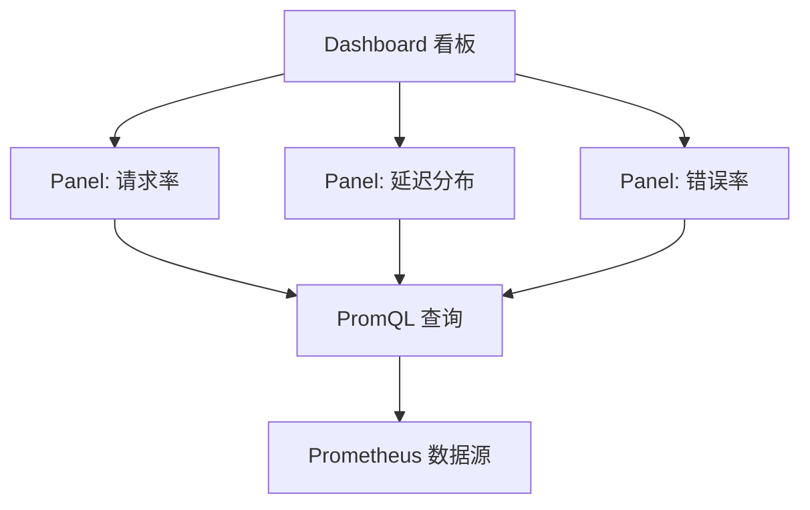

# 第一章：核心概念

在本章中，我们将回答三个根本问题：**可观测性是什么？Prometheus 和 Grafana 分别解决什么问题？它们如何协作？**

在你动手写代码之前，先建立一个完整的心理模型（mental model），会让后面的学习事半功倍。

---

## 1.1 可观测性 vs 监控

传统「监控」回答的问题是：**「某个东西是不是坏了？」**

而现代「可观测性」回答的问题是：**「系统内部正在发生什么？」** —— 无论你有没有预先想到这个场景。

| 维度 | 传统监控 | 可观测性 |
|------|---------|---------|
| 数据来源 | 预定义的告警规则 | 任意指标的高维数据 |
| 问题发现 | 已知的故障模式 | 未知的异常模式 |
| 分析方式 | 「CPU > 90% 就告警」 | 「为什么 CPU 在 14:32 突然飙升？」 |
| 核心支柱 | 指标 (Metrics) | 指标 + 日志 (Logs) + 链路 (Traces) |

本项目聚焦于可观测性的第一根支柱 —— **指标 (Metrics)**。

> **一句话总结**：监控告诉你「着火了」，可观测性帮你搞清楚「火是从哪个房间烧起来的」。

---

## 1.2 Prometheus 是什么？

Prometheus 是由 SoundCloud 开源的系统监控和告警工具包，2016 年加入 CNCF（云原生计算基金会），是 Kubernetes 之后第二个 CNCF 毕业项目。

### Prometheus 的四个核心设计理念

**1. 拉取模型 (Pull-based)**

Prometheus **主动**去目标服务拉取指标，而不是等目标服务推送过来。这是一个深思熟虑的设计选择：

```
传统推送模型:     App → Push → [监控系统]
Prometheus 模型:  App (暴露 /metrics) ← Pull ← [Prometheus]
```

**优点**：
- 无需修改应用程序的配置即可确定监控目标
- Prometheus 自己控制抓取频率，不会因为应用故障导致数据积压
- 更容易判断目标是否存活（拉不到数据 = 目标挂了）

**2. 多维数据模型**

传统监控大多是「name = value」的键值对，Prometheus 使用**标签 (label)** 来标识时间序列：

```
# 传统方式
cpu_usage = 85%

# Prometheus 方式（标签提供了多维度过滤能力）
http_requests_total{method="GET", endpoint="/api/users", status="200"} 10234
http_requests_total{method="POST", endpoint="/api/users", status="500"} 15
```

这让你可以用同一个指标名，通过不同的标签组合回答不同的问题：
- 「GET /api/users 有多少请求？」→ 过滤 method + endpoint
- 「所有 5xx 错误有多少？」→ 过滤 status
- 「每个接口的错误比例是多少？」→ 按 endpoint 分组聚合

**3. PromQL 查询语言**

PromQL (Prometheus Query Language) 是一种函数式的时序数据查询语言。它不是 SQL —— 它专为时序数据设计，内置了 rate、histogram_quantile 等常用函数。

```promql
# 过去一分钟内每秒的 HTTP 请求数
rate(http_requests_total[1m])

# 99% 的请求在多少秒内完成
histogram_quantile(0.99, rate(http_request_duration_seconds_bucket[5m]))
```

**4. 不依赖外部存储**

Prometheus 自带 TSDB（时序数据库），单节点就能处理数百万条时间序列。它不依赖 HBase 或 Cassandra 等外部存储，部署极其简单 —— 一个二进制文件即可运行。

---

## 1.3 Grafana 是什么？

如果 Prometheus 是数据的**采集者**和**存储者**，Grafana 就是数据的**展示者**和**叙事者**。

Grafana 是一个通用的数据可视化平台，支持 Prometheus、InfluxDB、Elasticsearch、MySQL 等数十种数据源。它的工作原理是：

```
Grafana Panel → 执行 PromQL 查询 → Prometheus 返回数据 → Grafana 渲染图表
```

### Grafana 的核心概念



| 概念 | 说明 | 类比 |
|------|------|------|
| **Dashboard** | 一组 Panel 的集合，用于监控一个服务或主题 | 一整页 PPT |
| **Panel** | 单个图表，包含一个或多个 PromQL 查询 | PPT 中的一张图表 |
| **Datasource** | 数据来源，如 Prometheus | 图表背后引用的 Excel 表格 |
| **Variable** | 动态筛选器，如按环境/服务名切换 | PPT 的筛选下拉框 |

---

## 1.4 这条链路如何协作？

让我们追踪一次完整的「用户请求 → 看到图表」的数据旅程：

```
┌─────────────────────────────────────────────────────────────────┐
│  第 1 步：应用程序采集指标                                          │
│                                                                   │
│  Go Server 在处理每个 HTTP 请求时，通过 Prometheus client 库        │
│  记录：                                                           │
│    - Counter: http_requests_total +1                              │
│    - Histogram: 请求耗时观测                                       │
│    - Gauge: 当前并发数                                             │
│                                                                   │
│  这些指标值累积在进程内存中。                                         │
└─────────────────────────────────────────────────────────────────┘
                              │
                              ▼
┌─────────────────────────────────────────────────────────────────┐
│  第 2 步：暴露 /metrics 端点                                        │
│                                                                   │
│  Go Server 注册了 /metrics 路由，由 promhttp.Handler() 处理。       │
│  访问 http://localhost:8080/metrics 会看到的输出：                   │
│                                                                   │
│  # HELP http_requests_total HTTP 请求总数                          │
│  # TYPE http_requests_total counter                               │
│  http_requests_total{method="GET",endpoint="/health",status="200"} 87│
│  http_requests_total{method="GET",endpoint="/api/hello",status="200"} 342│
│  ...                                                              │
└─────────────────────────────────────────────────────────────────┘
                              │
                              ▼ (每 5 秒抓取一次)
┌─────────────────────────────────────────────────────────────────┐
│  第 3 步：Prometheus 定期抓取                                       │
│                                                                   │
│  Prometheus 按照 prometheus.yml 的配置：                            │
│    - 每 5 秒向 server:8080 发起 GET /metrics                       │
│    - 将数据附带时间戳存入本地 TSDB                                  │
│    - 数据保留 7 天（可配置）                                         │
│                                                                   │
│  这是 Prometheus 「拉取模型」的完整体现。                             │
└─────────────────────────────────────────────────────────────────┘
                              │
                              ▼
┌─────────────────────────────────────────────────────────────────┐
│  第 4 步：Grafana 查询并渲染                                         │
│                                                                   │
│  用户在 Grafana 的 Dashboard 中查看图表：                            │
│    1. Grafana 向 Prometheus 发送 PromQL 查询                        │
│    2. Prometheus 计算并返回结果                                      │
│    3. Grafana 将数据点渲染为折线图/柱状图/仪表盘                      │
│                                                                   │
│  这个过程是「按需」的 —— 每次打开 Dashboard 或自动刷新时才执行查询。    │
└─────────────────────────────────────────────────────────────────┘
```

---

## 1.5 本项目学习路径

本项目的组织方式是 **「边做边学」**：

| 步骤 | 你在做什么 | 你学到什么 |
|------|-----------|-----------|
| 1. 启动环境 | `docker compose up --build` | 认识 Docker Compose 服务编排 |
| 2. 查看原始指标 | 访问 `/metrics` | 理解 Prometheus 数据格式 |
| 3. 发送流量 | client 自动发送请求 | 体验指标数据的产生过程 |
| 4. PromQL 练习 | 在 Prometheus UI 写查询 | 掌握 PromQL 基础语法 |
| 5. 查看 Dashboard | Grafana 预置面板 | 理解可视化如何映射为 PromQL |
| 6. 阅读文档 | 二、三、四章 | 深入理解指标类型和查询技巧 |

建议的学习时间分配：**70% 动手 + 30% 阅读**。每个概念在看懂后立刻去 UI 上试一下。

---

## 本章小结

- **Prometheus** = 指标的采集器 + 时序数据库 + 查询引擎
- **Grafana** = 数据可视化平台，通过 PromQL 查询 Prometheus
- **拉取模型** 是 Prometheus 区别于传统监控的核心特征
- 完整链路：**App 埋点 → /metrics 暴露 → Prometheus 抓取 → Grafana 展示**
